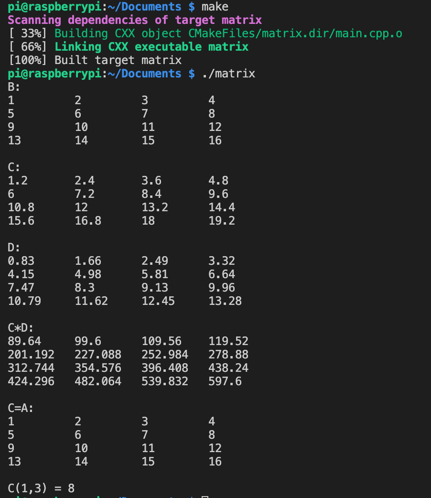

# **CS205 C/ C++ Program Design** 

# Assignment 4

Name: 王康

SID: 11510815

## Part 1. Source Code

https://github.com/apostlewang/CS205_CPP/tree/master/Assigment4

## Part 2. Result & Verification

### 1.Class Matrix

头文件如下

```cpp
class Matrix
{
private:
    /* data */
    int num_rows;
    int num_columns;
    float * data;
    int *refcount;

public:
    Matrix(int num_rows, int num_columns, float* data);
    Matrix(const Matrix &m);
    ~Matrix();
    Matrix operator* (const Matrix &m) const;
    Matrix operator* (const float a) const;
    Matrix& operator= (const Matrix &m);
    float operator() (int row, int column) const;
    friend Matrix operator* (const float a,const Matrix &m);  
    friend ostream& operator<<(ostream &os,const Matrix &m);
    friend float* multiMatrix(const Matrix &a, const Matrix &b);
};
```

数据部分设置为private，其中refcout会统计一块data数据区域被使用多少次（共享一块内存的对象也共享这个数字），使用copy constructor和重载的赋值运算符均会使得其增加。对应到destructor的设计，就是只有当某块数据区域的refcount为0时才会删除这块数据，否则对refcount减去1。

下面是函数的声明，均在Matrix.cpp中具体实现。

### 2.Constructors, destructor, operators overloading

operator = 赋值运算符重载

```cpp
Matrix& Matrix::operator= (const Matrix &m){    
    if (this == &m){
        return *this;
    }
    this->num_columns = m.num_columns;
    this->num_rows = m.num_rows;
    if(this->refcount == 0){
        delete [] this->data;
    }
    else{
        *(this->refcount) -= 1;
    }
    this->refcount = m.refcount;
    *refcount += 1;
    this->data = m.data;
    return *this;
}
```

operator << 重载赋值运算符

```c++
ostream& operator<<(ostream &os,const Matrix &m){
    for (size_t i = 0; i < m.num_rows; i++)
    {
        for (size_t j = 0; j < m.num_columns; j++)
        {
            os << setw(10)<< left << m.data[i*m.num_columns+j];
        }
        os << endl;
    }
    os << endl;
    return os;
}
```


### 3.Operator * overloading

```cpp
Matrix Matrix::operator* (const Matrix &m) const{  
    float* newdata = multiMatrix(*this,m);
    Matrix result = Matrix(num_rows,m.num_columns,newdata);
    return result;
}

Matrix Matrix::operator* (const float a) const{
    float * newdata = new float[num_columns*num_rows];
    for (size_t i = 0; i < num_columns*num_rows; i++)
    {
        newdata[i] = data[i]*a;
    }
    Matrix result = Matrix(num_rows,num_columns,newdata);
    return result;
}
Matrix operator* (const float a,const Matrix &m){
    float * newdata = new float[m.num_columns*m.num_rows];
    for (size_t i = 0; i < m.num_columns*m.num_rows; i++)
    {
        newdata[i] = m.data[i]*a;
    }
    Matrix result = Matrix(m.num_rows,m.num_columns,newdata);
    return result;
}
```

在main中验证三种重载运算符“*”的代码：

```c++
    Matrix C = A*1.2;
    cout << "C:" << endl << C;
    Matrix D = 0.83*A;
    cout << "D:" << endl << D;
    cout << "C*D:" << endl << C*D;
```

### 4.Compile and run the program on an ARM development board

在树莓派上的运行截图如下：



### 5.Host in Github

https://github.com/apostlewang/CS205_CPP/tree/master/Assigment4

### 6.Use Cmake to manage code

CMakeLists文件内容如下：

```cmake
project(mymatrix)
add_executable(matrix main.cpp Matrix.cpp)
```

